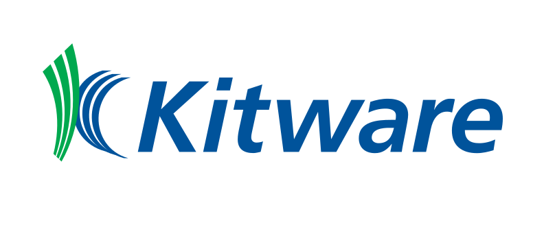

# AutoPyBind11

Welcome to the repository hosting the 2021 SciPyCon poster for [AutoPyBind11](https://gitlab.kitware.com/autopybind11/autopybind11), an automated C++ -> Python binding code generator. This README serves as instruction on how to get the most out of the poster experience.

## The Poster

#### RTD

This poster is comprised of two components, a [read the docs instance](https://autopybind11.readthedocs.io/en/latest/?) and a binder instance. The RTD is compirsed of all extant documentation for AutoPyBind11, installation instructions, and a walkthrough on general useage.

#### Binder

The remainder of this poster is distributed across a few directories in a layout described below. In each directory, is one or more Jupyter Notebooks, as well as various configuration files, C++ sample code, and build system files.

<pre>
root ----| - advanced_examples
         | - example
         | - sample
</pre>

Each directory (or subdirectory) is an example of AutoPyBind11 useage on a C++ codebase. The example and advanced example directories are
intended to be a replication of the PyBind11 test and examples. The application of AutoPyBind11 to these examples can be used to
compare the code exposed to Python, the actual binding code itself, and the proccess by which the binding code is created.

To get the most out of these examples, navigate to the requesite directory and follow the instructions described on the Notebooks.

The final directory is the sample directory. It contains a notebook that has been setup to run AutoPyBind11 over a custom code base.
Essentially the notebook provides a sandbox in which you can run AutoPyBind11 over your own (or someone else's) C++ code without the overhead of setting up or installing AutoPyBind11. Following the instructions on the Notebook, you can upload C++ code, and either use the notebook or upload your own CMake driver code to run AutoPyBind11 and generate a Python module.

The binder instance can be accessed via the badge below.

